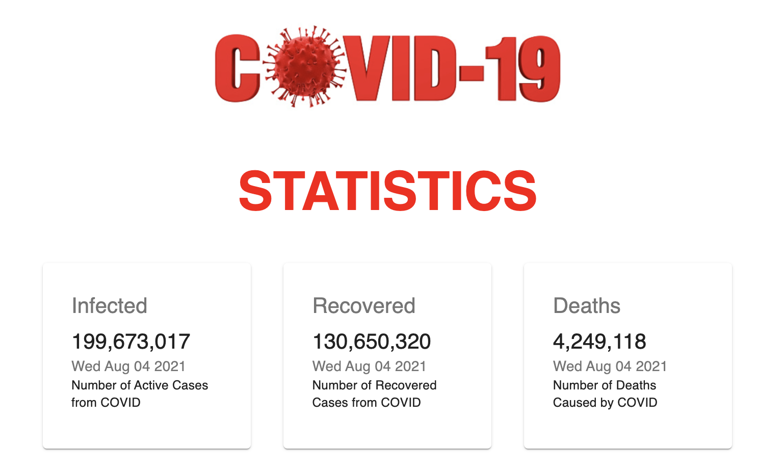

## Corona Virus Tracker

A web app built using ReactJS. It provides a platform where people can see the status of COVID
around the world.

This project is using [Mathdroid COVID-19 API](https://github.com/mathdroid/covid-19-api)

### Tools and Library used for this project
* React
* Material UI
* ChartJS

## Demo


## Installation
If you want to run the app in local system, follow simple steps:
* Fork the repo
* clone the repo
    ```
    git clone https://github.com/<YOUR USERNAME>/CoronaVirus-Tracker.git
    Move to the directry
    npm install
    ```
    ### Run the App
    ```
    npm start
    ```
* Now, you are good to go

Hope you will like it. Thanks :)